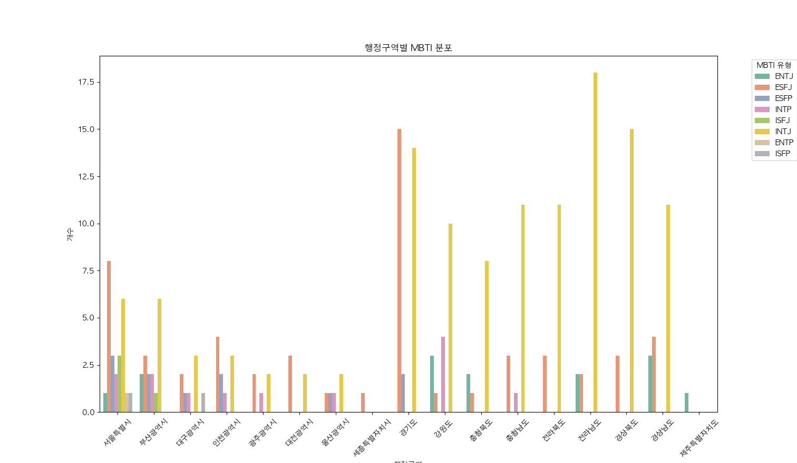

# Space-MBTI: 한국 지역 특성 기반 유형 분석

## 개요

이 프로젝트는 한국 전역의 지역 특성을 이해하기 위해 사람의 성격을 분석하는 16가지 MBTI 지표를 지역 분석에 적용한 "Space-MBTI"라는 새로운 접근 방식을 적용하였습니다. Space-MBTI는 경제, 인프라, 문화, 생활 방식 등의 요소를 기반으로 16가지 유형 중 하나로 지역을 분류하여, 각 지역의 고유한 특성과 정체성을 분석합니다.

2023년, 행정안전부는 건축공간연구원에서 인구감소 대응 전략 연구 결과로, ['맞춤형 공간전략 도출을 위한 인구감소지역 진단체계 연구 : ‘현안 체크리스트’와 ‘지역 Space-MBTI’의 개발과 적용'](https://www.auri.re.kr/publication/view.es?mid=a10312000000&publication_id=2010&publication_type=research)​라는 연구 보고서를 발간했습니다. 이를 바탕으로 한국 전역의 행정구역에 대한 Space-MBTI 분석을 확장하고 심화하는 것을 목표로 합니다.

## Space-MBTI

Space-MBTI 모델은 다음 네 가지 주요 지표로 구성됩니다.

1. **E vs I : 경제기반 인구, 에너지 원천에 따른 Energy(인구) 구분**

   - E(외부 유인 / Externality): 외부인을 적극적으로 받아들여 에너지를 키울 것인가
     키워드: 능동적, 표현적, 다양성, 새로움, 활동적, 열성적
   - I(내부 유인 / Internality): 내부 인구를 안정적으로 지키며 나아갈 것인가
     키워드: 수동적, 보유적, 밀접한, 어울림, 신중함, 안정적

   경제적 효과를 유발하는 인구 비중으로 방문 인구(관광객 등)와 정주 인구의 비중 차이에 따라 E 또는 I로 구분. E는 관광인구 및 관계인구 등 생활인구와 같은 외부 인구를 적극적으로 받아들이는 지역으로 새로운 에너지를 지향하는 반면, I의 경우, 내부 정주인구 중심의 안정적이고 경험적 정착을 지향하는 지역으로 인구 유입보다는 내부 인구 중심의 경제활동이 구축된 지역적 특성을 보유함.

2. **N vs S : 입지적 특성, 공간적 환경에 따른 Position(입지) 구분**

   - N(자연 요소 / Nature): 자연적으로 주어진 것을 적극 활용하여 성장할 것인가
     키워드: 구체적, 현실적, 실용적, 경험적, 전통적, 관습적
   - S(인공 요소 / Structure): 기존에 공급된 도시적 자원을 활성화할 것인가
     키워드: 상징적, 창의적, 개념적, 이론적, 독창적, 새로움

   지역을 대표하는 입지 특징이 자연적 요소가 많은지, 경제적 거점이나 광역 지역에서의 중심지로 도시적 인프라를 구축하고 있는지에 따라 N 또는 S로 구분. N은 타 지역과 차별화되는 자연자원을 활용하여 상품화하거나, 인규유입을 유도하는 등의 계획을 수립하고 인프라 및 사업 투자 근거를 제시할 수 있음. S는 지역 고유의 역량 산업을 재검토하고 경제적 인구 유입이 가능한 활성화 전략을 수립, 기존 투자된 인프라의 활용도를 제고하고 지역 거점의 역할을 수행하는지 검토함.

3. **T vs F : 지역 가치, 성장 가치에 따른 Value(지역가치) 구분**

   - T(전통 유산 / Tradition): 선대의 유산을 적극 활용하여 지역적 차별성을 만들 것인가
     키워드: 정서적, 감성적, 희생적, 허용적, 온건한, 과정지향
   - F (미래 유산 / Future): 새로운 경제적 엔진을 만들어 지역 차별화를 만들 것인가
     키워드: 논리적, 이성적, 도전적, 비평적, 강인한, 결론지향

   지역 대표 주요 가치에 따라 T 또는 F로 구분. T는 전통적 유산, S는 근대 및 현대 산업시설 등 새로운 경제적 엔진으로 조성하여 지역 차별성 구축이 가능한 미래가치 요소가 중점임.

4. **P vs J : 전개 방식, 지역 특수성에 따른 Lifestyle(라이프스타일) 구분**

   - P (일시적 / temPorary): 한시적 에너지 집중형으로 소프트웨어 중심의 투입이 필요한가
     키워드: 유연성, 개방적, 임박착수, 자발성, 과정적, 융통성
   - J (일상적 / Journey): 상시적이고 계획적이며 하드웨어 중심의 확대가 필요한가  
     키워드: 체계성, 목표지향성, 초기착수, 계획성, 방법적, 조직적

   지역 생활 및 경제 사회적 전개 방식, 지역 특수성에 따라 P 또는 J로 구분.
   P는 한시적 에너지를 집중적으로 쏟아 내거나 계절성이 강한 일을 영위하는 비율이 높은 지역이고, J는 일반적인 라이프스타일을 영위하며 계획적이고 일상성이 기반이 되어 있는 일상적 스타일의 지역임.

## 방법론

이 프로젝트는 2023년 행정안전부의 지방자치단체 인구 현황 자료와 Space-MBTI 모델을 활용하여 한국의 250개 행정구역을 분석하고 분류했습니다. 각 지역의 Space-MBTI 유형은 GPT 기반의 대형 언어 모델(LLM)을 사용하여 예측했습니다.

| 행정구역       | 시 / 구 / 군   | Space-MBTI | 행정구역   | 시 / 구 / 군 | Space-MBTI |
| -------------- | -------------- | ---------- | ---------- | ------------ | ---------- |
| 서울특별시     | 종로구         | ENTJ       | 부산광역시 | 중구         | ENTJ       |
| 서울특별시     | 중구           | ESFJ       | 부산광역시 | 서구         | INTJ       |
| 서울특별시     | 용산구         | ESFJ       | 부산광역시 | 동구         | INTJ       |
| 서울특별시     | 성동구         | ESFP       | 부산광역시 | 영도구       | INTP       |
| 서울특별시     | 광진구         | INTP       | 부산광역시 | 부산진구     | ESFJ       |
| 서울특별시     | 동대문구       | ISFJ       | 부산광역시 | 동래구       | INTJ       |
| 서울특별시     | 중랑구         | INTJ       | 부산광역시 | 남구         | ESFP       |
| 서울특별시     | 성북구         | INTJ       | 부산광역시 | 북구         | INTJ       |
| 서울특별시     | 강북구         | INTJ       | 부산광역시 | 해운대구     | ESFJ       |
| 서울특별시     | 도봉구         | INTJ       | 부산광역시 | 사하구       | INTP       |
| 서울특별시     | 노원구         | INTP       | 부산광역시 | 금정구       | INTJ       |
| 서울특별시     | 은평구         | ENTP       | 부산광역시 | 강서구       | ENTJ       |
| 서울특별시     | 서대문구       | ESFJ       | 부산광역시 | 연제구       | ESFJ       |
| 서울특별시     | 마포구         | ESFP       | 부산광역시 | 수영구       | ESFP       |
| 서울특별시     | 양천구         | INTJ       | 부산광역시 | 사상구       | ISFJ       |
| 서울특별시     | 강서구         | ESFJ       | 부산광역시 | 기장군       | INTJ       |
| 서울특별시     | 구로구         | ESFP       | 대구광역시 | 중구         | ESFJ       |
| 서울특별시     | 금천구         | ISFJ       | 대구광역시 | 동구         | INTJ       |
| 서울특별시     | 영등포구       | ESFJ       | 대구광역시 | 서구         | INTP       |
| 서울특별시     | 동작구         | ISFJ       | 대구광역시 | 남구         | ISFP       |
| 서울특별시     | 관악구         | ISFP       | 대구광역시 | 북구         | INTJ       |
| 서울특별시     | 서초구         | ESFJ       | 대구광역시 | 수성구       | ESFJ       |
| 서울특별시     | 강남구         | ESFJ       | 대구광역시 | 달서구       | ESFP       |
| 서울특별시     | 송파구         | ESFJ       | 대구광역시 | 달성군       | INTJ       |
| 서울특별시     | 강동구         | INTJ       | 경기도     | 수원시       | ESFJ       |
| 인천광역시     | 강화군         | INTJ       | 경기도     | 고양시       | ESFJ       |
| 인천광역시     | 웅진군         | INTJ       | 경기도     | 용인시       | ESFJ       |
| 인천광역시     | 중구           | ESFJ       | 경기도     | 성남시       | ESFJ       |
| 인천광역시     | 동구           | INTP       | 경기도     | 부천시       | ESFJ       |
| 인천광역시     | 미추홀구       | ESFP       | 경기도     | 화성시       | INTJ       |
| 인천광역시     | 연수구         | ESFJ       | 경기도     | 안산시       | ESFP       |
| 인천광역시     | 남동구         | ESFJ       | 경기도     | 남양주시     | INTJ       |
| 인천광역시     | 부평구         | ESFP       | 경기도     | 안양시       | ESFJ       |
| 인천광역시     | 계양구         | INTJ       | 경기도     | 평택시       | ESFP       |
| 인천광역시     | 서구           | ESFJ       | 경기도     | 시흥시       | ESFJ       |
| 광주광역시     | 동구           | INTJ       | 경기도     | 파주시       | INTJ       |
| 광주광역시     | 서구           | ESFJ       | 경기도     | 의정부시     | ESFJ       |
| 광주광역시     | 남구           | INTP       | 경기도     | 김포시       | INTJ       |
| 광주광역시     | 북구           | INTJ       | 경기도     | 광주시       | INTJ       |
| 광주광역시     | 광산구         | ESFJ       | 경기도     | 광명시       | ESFJ       |
| 대전광역시     | 동구           | INTJ       | 경기도     | 군포시       | ESFJ       |
| 대전광역시     | 중구           | ESFJ       | 경기도     | 하남시       | ESFJ       |
| 대전광역시     | 서구           | ESFJ       | 경기도     | 오산시       | ESFJ       |
| 대전광역시     | 유성구         | ESFJ       | 경기도     | 양주시       | INTJ       |
| 대전광역시     | 대덕구         | INTJ       | 경기도     | 이천시       | INTJ       |
| 울산광역시     | 중구           | ESFJ       | 경기도     | 구리시       | ESFJ       |
| 울산광역시     | 남구           | ESFP       | 경기도     | 안성시       | INTJ       |
| 울산광역시     | 동구           | INTJ       | 경기도     | 포천시       | INTJ       |
| 울산광역시     | 북구           | INTP       | 경기도     | 의왕시       | ESFJ       |
| 울산광역시     | 울주군         | INTJ       | 경기도     | 양평군       | INTJ       |
| 세종특별자치시 | 세종특별자치시 | ESFJ       | 경기도     | 여주시       | INTJ       |
| 충청북도       | 청주시         | ESFJ       | 경기도     | 동두천시     | INTJ       |
| 충청북도       | 충주시         | ENTJ       | 경기도     | 가평군       | INTJ       |
| 충청북도       | 제천시         | INTJ       | 경기도     | 과천시       | ESFJ       |
| 충청북도       | 보은군         | INTJ       | 경기도     | 연천군       | INTJ       |
| 강원도         | 춘천시         | ENTJ       | 충청북도   | 영동군       | INTJ       |
| 강원도         | 원주시         | ESFJ       | 충청북도   | 증평군       | INTJ       |
| 강원도         | 강릉시         | ENTJ       | 충청북도   | 진천군       | ENTJ       |
| 강원도         | 동해시         | INTJ       | 충청북도   | 괴산군       | INTJ       |
| 강원도         | 태백시         | INTP       | 충청북도   | 음성군       | INTJ       |
| 강원도         | 속초시         | ENTJ       | 충청북도   | 단양군       | INTJ       |
| 강원도         | 삼척시         | INTP       | 충청남도   | 천안시       | ESFJ       |
| 강원도         | 홍천군         | INTJ       | 충청남도   | 공주시       | INTJ       |
| 강원도         | 횡성군         | INTJ       | 충청남도   | 보령시       | INTP       |
| 강원도         | 영월군         | INTP       | 충청남도   | 아산시       | ESFJ       |
| 강원도         | 평창군         | INTJ       | 충청남도   | 서산시       | INTJ       |
| 강원도         | 정선군         | INTJ       | 충청남도   | 논산시       | INTJ       |
| 강원도         | 철원군         | INTJ       | 충청남도   | 계룡시       | INTJ       |
| 강원도         | 화천군         | INTJ       | 충청남도   | 당진시       | ESFJ       |
| 강원도         | 양구군         | INTJ       | 충청남도   | 금산군       | INTJ       |
| 강원도         | 인제군         | INTJ       | 충청남도   | 부여군       | INTJ       |
| 강원도         | 고성군         | INTJ       | 충청남도   | 서천군       | INTJ       |
| 강원도         | 양양군         | INTP       | 충청남도   | 청양군       | INTJ       |
| 경상북도       | 포항시         | ESFJ       | 충청남도   | 홍성군       | INTJ       |
| 경상북도       | 경주시         | INTJ       | 충청남도   | 예산군       | INTJ       |
| 경상북도       | 김천시         | INTJ       | 충청남도   | 태안군       | INTJ       |
| 경상북도       | 안동시         | INTJ       | 전라북도   | 전주시       | ESFJ       |
| 경상북도       | 구미시         | ESFJ       | 전라북도   | 군산시       | ESFJ       |
| 경상북도       | 영주시         | INTJ       | 전라북도   | 익산시       | ESFJ       |
| 경상북도       | 영천시         | INTJ       | 전라북도   | 정읍시       | INTJ       |
| 경상북도       | 상주시         | INTJ       | 전라북도   | 남원시       | INTJ       |
| 경상북도       | 문경시         | INTJ       | 전라북도   | 김제시       | INTJ       |
| 경상북도       | 경산시         | ESFJ       | 전라북도   | 완주군       | INTJ       |
| 경상북도       | 군위군         | INTJ       | 전라북도   | 진안군       | INTJ       |
| 경상북도       | 의성군         | INTJ       | 전라북도   | 무주군       | INTJ       |
| 경상북도       | 청송군         | INTJ       | 전라북도   | 장수군       | INTJ       |
| 경상북도       | 영양군         | INTJ       | 전라북도   | 임실군       | INTJ       |
| 경상북도       | 영덕군         | INTJ       | 전라북도   | 순창군       | INTJ       |
| 경상북도       | 청도군         | INTJ       | 전라북도   | 고창군       | INTJ       |
| 경상북도       | 고령군         | INTJ       | 전라북도   | 부안군       | INTJ       |
| 경상북도       | 성주군         | INTJ       | 전라남도   | 목포시       | ESFJ       |
| 경상남도       | 창원시         | ESFJ       | 전라남도   | 여수시       | ENTJ       |
| 경상남도       | 진주시         | ESFJ       | 전라남도   | 순천시       | ENTJ       |
| 경상남도       | 통영시         | ENTJ       | 전라남도   | 나주시       | INTJ       |
| 경상남도       | 사천시         | ENTJ       | 전라남도   | 광양시       | ESFJ       |
| 경상남도       | 김해시         | ESFJ       | 전라남도   | 담양군       | INTJ       |
| 경상남도       | 밀양시         | INTJ       | 전라남도   | 곡성군       | INTJ       |
| 경상남도       | 거제시         | ENTJ       | 전라남도   | 구례군       | INTJ       |
| 경상남도       | 양산시         | ESFJ       | 전라남도   | 고흥군       | INTJ       |
| 경상남도       | 의령군         | INTJ       | 전라남도   | 보성군       | INTJ       |
| 경상남도       | 함안군         | INTJ       | 전라남도   | 화순군       | INTJ       |
| 경상남도       | 창녕군         | INTJ       | 전라남도   | 장흥군       | INTJ       |
| 경상남도       | 고성군         | INTJ       | 전라남도   | 강진군       | INTJ       |
| 경상남도       | 남해군         | INTJ       | 전라남도   | 해남군       | INTJ       |
| 경상남도       | 하동군         | INTJ       | 전라남도   | 영암군       | INTJ       |
| 경상남도       | 산청군         | INTJ       | 전라남도   | 무안군       | INTJ       |
| 경상남도       | 함양군         | INTJ       | 전라남도   | 함평군       | INTJ       |
| 경상남도       | 거창군         | INTJ       | 전라남도   | 영광군       | INTJ       |
| 경상남도       | 합천군         | INTJ       | 전라남도   | 장성군       | INTJ       |
| 제주특별자치도 | 제주시         | ENTJ       | 전라남도   | 완도군       | INTJ       |
| 제주특별자치도 | 서귀포시       | ENTJ       | 전라남도   | 진도군       | INTJ       |
|                |                |            | 전라남도   | 신안군       | INTJ       |

### 데이터 소스

- 2023년 지방자치단체 행정구역: 행정안전부 제공.
- Space-MBTI 연구 보고서: 건축공간연구원 발행.

### 사용 도구

- GPT-4o Model: space-MBTI 결과 도출
- Python: 데이터 처리 및 분석.
- Matplotlib & Seaborn: 데이터 시각화.
- Pandas: 데이터 조작 및 분석.

## 결과

### 전반적인 공간 특성 분포

INTJ 유형이 전체적으로 많은 비중을 차지하고 있다. 내부 인구를 중심으로 안정적이고 계획적인 발전을 추구하는 지역이 많다는 것을 의미다. 특히 전통적인 가치와 자연적 요소를 중시하는 지역들이 많은 것을 볼 수 있다.

ESFJ 유형은 외부 인구를 받아들이며, 도시적 자원과 미래 유산을 활용하여 발전을 도모하는 지역에서 주로 나타난다. 큰 도시나 발전된 인프라를 보유한 지역에서 많이 볼 수 있었다.

​

### 도시와 군의 차이

도시 지역은 ESFJ와 ENTJ 유형이 많아 외부 인구 유입을 활발히 받아들이고, 도시적 자원과 미래 가치를 중시하는 경향이 있다. 주로 대도시와 중심지를 포함한 지역에서 나타나는 경향이다.

군 지역은 대체로 INTJ 유형이 우세하며, 내부 인구를 중심으로 안정적인 발전을 추구하고, 자연적 요소와 전통을 중시하는 경향이 강하다. 자연 환경이 풍부하고 농업 및 전통 산업이 발달한 지역에서 주로 나타난다.

​

### 지역별 특징

서울특별시와 같은 대도시는 ESFJ, ENTJ, 그리고 ESFP 유형이 두드러진다. 외부 인구 유입과 도시적 자원을 적극적으로 활용하는 특성을 보여준다. 이를 통해 서울이 다양한 경제적 활동과 문화적 다양성을 지닌 국제적인 도시임을 반영한다.

부산광역시는 ESFJ와 INTJ가 혼재되어 있으며, 중심지에서의 활발한 경제 활동과 더불어 주변 지역에서의 안정적인 발전 추구가 함께 나타난다.

대구광역시와 광주광역시는 INTJ 유형이 강세를 보이고 있으며, 상대적으로 전통적이고 안정적인 발전을 선호하는 지역 특성을 반영한다.

경기도는 서울의 위성도시들이 많아 ESFJ 유형이 두드러진다. 서울과의 연계된 발전 전략과 외부 인구 유입을 통한 성장이 중요한 지역임을 시사한다.

강원도, 충청남도, 전라남도, 경상북도 등의 여러 군 지역에서는 INTJ 유형이 지배적이다. 자연 자원을 활용하고 전통 유산을 보존하며, 내부 인구를 중심으로 한 안정적인 경제 활동이 중요한 지역적 특성임을 나타낸다.

제주특별자치도, 특히 제주시와 서귀포시는 모두 ENTJ 유형으로, 자연적 요소를 적극 활용하며 외부 인구 유입을 통해 미래 지향적인 발전을 도모하는 특성을 보인다. 이를 통해 제주가 관광 산업을 중심으로 성장하고 있는 점을 반영한다.
